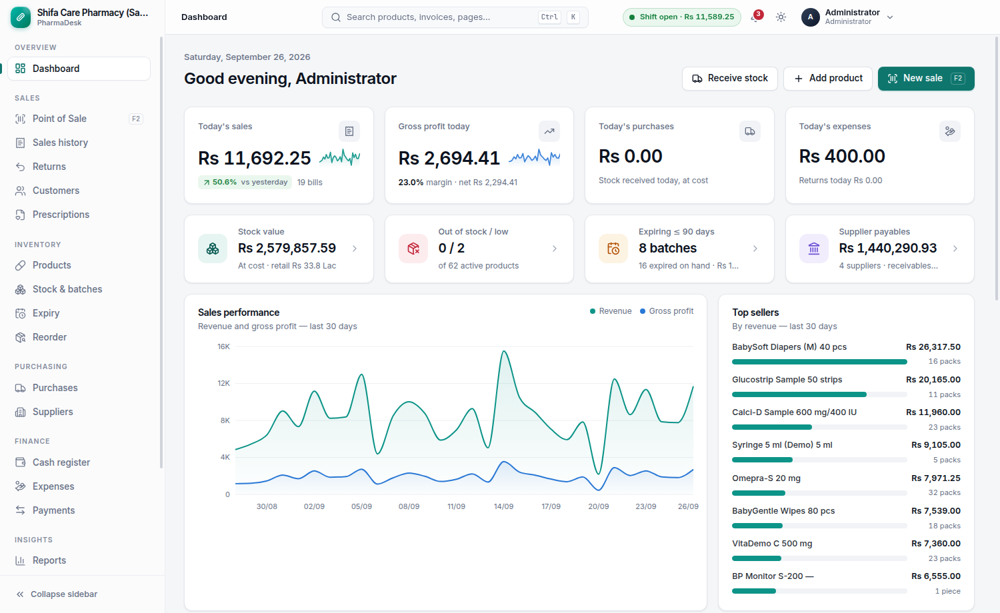

# PharmaDesk — Offline Pharmacy Management System

A production-grade, **offline-first** desktop system for retail pharmacies: point of sale,
batch-level inventory with FEFO, purchasing, expiry management, suppliers, customers and
prescriptions, expenses, cash drawer control, accounting-grade profit reports, users and
permissions, a tamper-evident audit log, and verified backup/restore.

Everything runs on the pharmacy computer. **No internet connection is needed at all.**
The app itself blocks all outbound network requests.



## Highlights

- **Fast, keyboard-driven POS**: barcode scanning, pack/unit selling, automatic FEFO batch
  selection, held bills, split payments, customer credit, thermal receipts (58/80 mm) and
  A4 invoices.
- **Every unit is traceable**: product → batch → stock movement → sale/purchase/return.
  Stock is changed only through movements; nothing is ever hard-deleted (voids and
  reversals instead).
- **Correct money**: integer paisa arithmetic, server-side recalculation of every sale,
  proportional refunds, landed cost with bonus goods, profit from the actual batch cost.
- **Controls**: role-based permissions, supervisor overrides for discounts/prices/Rx items,
  shift-based cash reconciliation, auto-lock, account lockout, full audit log.
- **31 reports** with charts, print, Excel and CSV export.
- **Backups**: verified, timestamped, never-overwriting backups to USB/external drives,
  automatic and on-exit backups, safe restore with a pre-restore safety copy.
- **Premium UI** with light and dark themes, command palette (Ctrl+K), and English UI
  ready for Urdu (RTL) translation.

## Technology

Electron 44 · React 19 · TypeScript · Tailwind CSS 4 · Radix UI · TanStack Query ·
Recharts · SQLite (better-sqlite3) · Drizzle ORM · Zod · Vitest · Playwright ·
electron-builder (NSIS).

## Getting started (development)

```bash
npm install          # Node 22.12+
npm run dev          # start the app with hot reload
```

Sign in with **admin / admin123** (you will be asked to change it). To explore with
fictional sample data, use **Settings → About → Load sample data**, or run
`npm run seed:demo` before starting.

| Command | Purpose |
|---|---|
| `npm run typecheck` | TypeScript checks (main + renderer) |
| `npm test` | Unit and integration tests for calculations and services |
| `npm run test:e2e` | Build, then drive the real app offline: sign-in, POS sale, every screen |
| `npm run seed:demo` | Load the sample pharmacy into an empty local database |
| `npm run dist:win` | Build the Windows installer → `release/<version>/PharmaDesk-Setup-<version>.exe` |
| `node scripts/make-icons.mjs` | Regenerate app icons from `build/icon.svg` |

The Windows installer is built on Windows (or on Linux with `wine`). The GitHub Actions
workflow in `.github/workflows/build.yml` runs the tests and publishes the installer as a
build artifact.

## Documentation

- [Architecture](docs/ARCHITECTURE.md): process model, security, offline design, modules, IPC
- [Database](docs/DATABASE.md): ERD, tables, constraints, integrity triggers
- [Business rules](docs/BUSINESS_RULES.md): FEFO, pricing, tax, returns, cash, profit formulas
- [User guide](docs/USER_GUIDE.md): installation, daily routine, POS shortcuts, backups

## Project layout

```
src/
  main/        Electron main process: database, services, IPC router, printing, backup
  preload/     Minimal, typed bridge (contextBridge) — the renderer has no Node access
  renderer/    React UI (design system, feature screens)
  shared/      Code used by both sides: money/date maths, calculations, schemas, types
drizzle/       SQL migrations (applied automatically at startup)
tests/         Vitest suites
scripts/       E2E smoke test, seed and icon tools
```

## License

MIT
