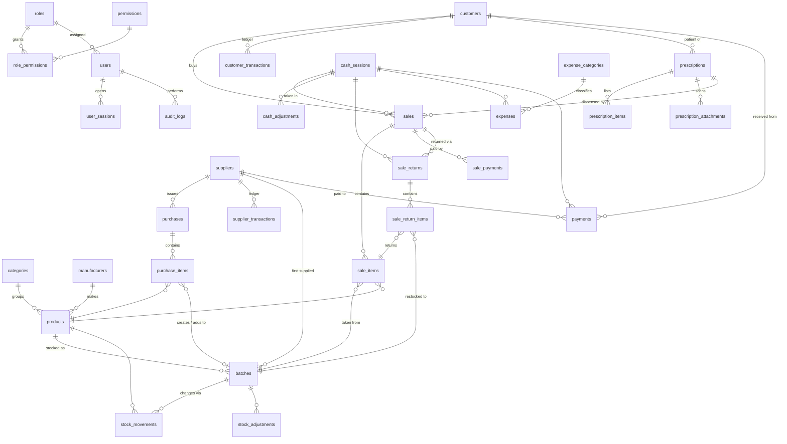

# PharmaDesk — Database Design

SQLite (WAL mode) accessed through Drizzle ORM. The canonical DDL is the migration SQL in
[`/drizzle`](../drizzle) generated from [`src/main/db/schema.ts`](../src/main/db/schema.ts),
plus hand-written integrity triggers.

## 1. Conventions

| Topic | Convention |
|---|---|
| Primary keys | `id INTEGER PRIMARY KEY AUTOINCREMENT` (fast joins). Business entities additionally carry `uuid TEXT UNIQUE` for future multi-branch sync |
| Money | `INTEGER` **paisa** (1 Rs = 100). Never floating point |
| Rates | `INTEGER` basis points (`1250` = 12.50 %) |
| Quantities | `INTEGER` in the product's **base unit** (tablet, bottle…) |
| Pack prices | `cost_price` / `sale_price` are **per pack**; line amount = `round(qty × price ÷ pack_size)` |
| Timestamps | `TEXT` ISO-8601 UTC (`2026-09-27T18:55:00.000Z`) |
| Business dates | `TEXT` `YYYY-MM-DD` (expiry, invoice date, expense date) |
| Booleans | `INTEGER` 0/1 |
| Deletion | Master data → `is_active = 0`. Financial documents → `status = 'VOID'` with `voided_by/at/reason`. Never hard-deleted |
| Document numbers | From `sequences` inside the same transaction: `INV-000001`, `PUR-000001`, `RET-000001`, `EXP-000001`, `PAY-000001`, `ADJ-000001`, `SHF-000001`, `RX-000001` |

## 2. Entity-relationship diagram

The core inventory chain is **PRODUCT → BATCH → STOCK_MOVEMENTS ← (PURCHASE_ITEM | SALE_ITEM | SALE_RETURN_ITEM | STOCK_ADJUSTMENT)**.
`batches.quantity_on_hand` is a cached balance maintained in the same transaction as the
movement; the integrity checker verifies `quantity_on_hand = Σ stock_movements.quantity` per batch.

## 3. Tables

### 3.1 Security

**roles** — `id`, `name` UNIQUE, `description`, `is_system` (Administrator cannot be deleted or lose permissions), `created_at`, `updated_at`

**permissions** — `key` PK (e.g. `sales.void`), `module`, `label`, `description`. Synchronised from code at startup.

**role_permissions** — `role_id` → roles, `permission_key` → permissions; PK(`role_id`,`permission_key`)

**users** — `id`, `uuid`, `username` UNIQUE (NOCASE), `full_name`, `phone`, `password_hash` (scrypt), `role_id` → roles, `is_active`, `must_change_password`, `failed_attempts`, `locked_until`, `last_login_at`, `created_at`, `updated_at`

**user_sessions** — `id`, `user_id` → users, `started_at`, `last_activity_at`, `ended_at`, `end_reason` (`LOGOUT`/`APP_EXIT`/`RESTORE`)

### 3.2 Configuration

**settings** — `key` PK, `value` (JSON), `updated_at`, `updated_by` → users

**sequences** — `key` PK (`sale`, `purchase`…), `prefix`, `next_value`, `padding`

### 3.3 Catalogue

**categories** — `id`, `uuid`, `name` UNIQUE NOCASE, `description`, `is_active`, timestamps

**manufacturers** — `id`, `uuid`, `name` UNIQUE NOCASE, `country`, `phone`, `is_active`, timestamps

**products**

| Column | Type | Notes |
|---|---|---|
| id, uuid | | |
| code | TEXT UNIQUE | Product ID shown to users (`P00001`), auto-generated if blank |
| barcode | TEXT UNIQUE NULL | Scanner input |
| brand_name | TEXT NOT NULL | e.g. *Panadol* |
| generic_name | TEXT | e.g. *Paracetamol* |
| manufacturer_id | → manufacturers | |
| category_id | → categories | |
| dosage_form | TEXT | Tablet, Capsule, Syrup, Injection, Cream, Drops, Inhaler, Device… |
| strength | TEXT | `500 mg`, `250 mg/5 ml` |
| pack_size | INTEGER ≥ 1 | base units per pack |
| unit_name / pack_name | TEXT | `Tablet` / `Box` |
| allow_loose_sale | BOOL | sell individual units |
| requires_prescription | BOOL | |
| is_controlled | BOOL | restricted / narcotic / psychotropic |
| storage_location | TEXT | rack / shelf |
| storage_condition | TEXT | e.g. `2–8 °C` |
| min_stock, reorder_level, max_stock | INTEGER | base units |
| default_cost_price, default_sale_price | INTEGER paisa / pack | used as defaults for new batches |
| tax_rate_bp | INTEGER | |
| is_active | BOOL | |
| notes | TEXT | |
| search_text | TEXT | normalised brand/generic/code/barcode/strength/manufacturer/category for fast search |
| created_by, created_at, updated_at | | |

Indexes: `barcode`, `code`, `brand_name`, `generic_name`, `category_id`, `manufacturer_id`, `is_active`.

### 3.4 Inventory

**batches**

| Column | Notes |
|---|---|
| id, uuid | |
| product_id → products | |
| batch_number | normalised upper-case; UNIQUE(`product_id`,`batch_number`) |
| manufacture_date | nullable |
| expiry_date | NOT NULL, `> manufacture_date` |
| cost_price | paisa per pack (weighted average if the batch is re-received) |
| sale_price | paisa per pack (MRP) |
| quantity_received | total units ever received into the batch |
| quantity_on_hand | cached balance (≥ 0 unless negative stock is enabled) |
| supplier_id, purchase_id | first receipt source |
| location | shelf/rack override |
| status | `ACTIVE` · `QUARANTINED` (blocked from sale) · `RECALLED` |
| created_at, updated_at | |

Indexes: (`product_id`,`expiry_date`) — FEFO lookup; `expiry_date`.

**stock_movements** (append-only — UPDATE/DELETE blocked by triggers)

| Column | Notes |
|---|---|
| id, uuid | |
| batch_id, product_id | |
| movement_type | `OPENING` · `PURCHASE` · `PURCHASE_VOID` · `SALE` · `SALE_VOID` · `SALE_RETURN` · `ADJUSTMENT_IN` · `ADJUSTMENT_OUT` · `WRITE_OFF` |
| quantity | signed base units (+ in, − out) |
| balance_after | batch balance after this movement |
| unit_cost | batch cost per pack at the time (valuation) |
| reference_type, reference_id | `purchase`, `sale`, `sale_return`, `adjustment` + row id |
| note, user_id, created_at | |

**stock_adjustments** — `id`, `uuid`, `adjustment_no`, `batch_id`, `product_id`, `direction` (`IN`/`OUT`), `reason` (`COUNT_CORRECTION`, `DAMAGED`, `EXPIRED`, `LOST`, `RETURN_TO_SUPPLIER`, `OPENING_STOCK`, `OTHER`), `quantity`, `cost_value`, `notes`, `created_by`, `created_at`

### 3.5 Purchasing & suppliers

**suppliers** — `id`, `uuid`, `name`, `contact_person`, `phone`, `email`, `address`, `city`, `ntn`, `strn`, `drug_license_no`, `payment_terms_days`, `opening_balance` (paisa, + = we owe), `notes`, `is_active`, timestamps

**supplier_transactions** (ledger, append-only) — `id`, `uuid`, `supplier_id`, `txn_date`, `type` (`OPENING_BALANCE`, `PURCHASE`, `PURCHASE_VOID`, `PAYMENT`, `PAYMENT_VOID`, `ADJUSTMENT`), `amount` (signed: **+ increases payable**), `reference_type`, `reference_id`, `description`, `created_by`, `created_at`. Balance = Σ amount.

**purchases** — `id`, `uuid`, `purchase_no` UNIQUE, `supplier_id`, `supplier_invoice_no`, `invoice_date`, `due_date`, `status` (`DRAFT`/`POSTED`/`VOID`), `subtotal`, `discount_total` (line), `invoice_discount`, `other_charges`, `tax_total`, `total`, `paid_amount`, `payment_method`, `notes`, `created_by`, `posted_by`, `posted_at`, `voided_by`, `voided_at`, `void_reason`, timestamps. Partial UNIQUE(`supplier_id`,`supplier_invoice_no`) WHERE status ≠ 'VOID'.

**purchase_items** — `id`, `purchase_id`, `line_no`, `product_id`, `batch_id` (set on posting), `batch_number`, `manufacture_date`, `expiry_date`, `quantity` (units), `bonus_quantity` (free units), `cost_price` (per pack), `sale_price` (per pack), `discount_bp`, `discount_amount`, `tax_rate_bp`, `tax_amount`, `line_total`, `landed_cost_price` (per pack, after bonus / invoice discount / charges allocation)

### 3.6 Customers & prescriptions

**customers** — `id`, `uuid`, `code` UNIQUE, `name`, `phone`, `address`, `notes`, `credit_limit`, `opening_balance`, `is_active`, timestamps

**customer_transactions** (ledger) — like supplier_transactions; **+ = customer owes pharmacy**. Types `OPENING_BALANCE`, `SALE_CREDIT`, `SALE_VOID`, `RETURN_CREDIT`, `PAYMENT`, `PAYMENT_VOID`, `ADJUSTMENT`.

**prescriptions** — `id`, `uuid`, `prescription_no`, `customer_id` (nullable), `patient_name`, `patient_age`, `prescriber_name`, `prescriber_registration`, `clinic`, `prescription_date`, `notes`, `recorded_by`, `status` (`ACTIVE`/`ARCHIVED`), timestamps

**prescription_items** — `id`, `prescription_id`, `product_id` (nullable), `medicine_text`, `quantity`, `instructions`

**prescription_attachments** — `id`, `prescription_id`, `file_name`, `mime_type`, `size`, `data` BLOB (kept inside the DB so a single backup file contains everything), `created_by`, `created_at`

### 3.7 Sales

**sales** — `id`, `uuid`, `invoice_no` UNIQUE, `customer_id`, `prescription_id`, `cash_session_id`, `status` (`COMPLETED`/`VOID`), `subtotal` (Σ gross), `discount_total`, `tax_total`, `round_off`, `total`, `paid_total`, `cash_tendered`, `change_due`, `credit_amount`, `cost_total`, `item_count`, `notes`, `created_by`, `created_at`, `voided_by`, `voided_at`, `void_reason`, `void_cash_session_id`

**sale_items** — one row **per batch** used: `id`, `sale_id`, `line_no`, `product_id`, `batch_id`, `product_name`, `batch_number`, `expiry_date` (snapshots), `pack_size`, `quantity`, `unit_price` (per pack), `unit_cost` (per pack), `gross_amount`, `discount_amount` (line + allocated invoice discount), `tax_rate_bp`, `tax_amount`, `line_total`, `cost_amount`, `returned_quantity`, `expired_override`

**sale_payments** — `id`, `sale_id`, `method` (`CASH`, `CARD`, `BANK_TRANSFER`, `MOBILE_WALLET`, `CREDIT`), `amount`, `reference`

**held_bills** — `id`, `label`, `customer_id`, `payload` (JSON cart), `item_count`, `total_estimate`, `created_by`, `created_at`

**sale_returns** — `id`, `uuid`, `return_no`, `sale_id`, `customer_id`, `cash_session_id`, `refund_method`, `subtotal`, `tax_total`, `total`, `cost_total`, `reason`, `notes`, `created_by`, `created_at`

**sale_return_items** — `id`, `return_id`, `sale_item_id`, `product_id`, `batch_id`, `quantity`, `amount`, `tax_amount`, `cost_amount`, `restock` (0 = disposed → `WRITE_OFF` movement)

### 3.8 Finance

**expense_categories** — `id`, `name` UNIQUE, `is_active`

**expenses** — `id`, `uuid`, `expense_no`, `expense_date`, `category_id`, `amount`, `description`, `payment_method`, `reference`, `cash_session_id`, `status` (`POSTED`/`VOID`), `created_by`, `created_at`, `voided_by`, `voided_at`, `void_reason`

**payments** — `id`, `uuid`, `payment_no`, `direction` (`OUT` to supplier / `IN` from customer), `supplier_id`, `customer_id`, `amount`, `method`, `reference`, `payment_date`, `notes`, `cash_session_id`, `status`, `created_by`, `created_at`, `voided_by`, `voided_at`, `void_reason`

**cash_sessions** — `id`, `uuid`, `session_no`, `status` (`OPEN`/`CLOSED`; partial UNIQUE on OPEN), `opened_by`, `opened_at`, `opening_cash`, `closed_by`, `closed_at`, `expected_cash`, `counted_cash`, `variance`, `denominations` (JSON), `summary` (JSON snapshot of all components at close), `closing_notes`

**cash_adjustments** — `id`, `cash_session_id`, `direction` (`IN`/`OUT`), `amount`, `reason`, `created_by`, `created_at`

### 3.9 Audit & operations

**audit_logs** (append-only) — `id`, `user_id`, `username`, `action`, `entity_type`, `entity_id`, `description`, `details` (JSON: before/after), `severity` (`INFO`/`WARNING`/`CRITICAL`), `created_at`

**backup_logs** — `id`, `file_path`, `file_name`, `size_bytes`, `kind` (`MANUAL`/`AUTO`/`PRE_RESTORE`/`EXIT`), `status`, `integrity`, `error`, `created_by`, `created_at`

## 4. Integrity triggers

Hand-written SQL in the migrations:

* `audit_logs`, `stock_movements`, `supplier_transactions`, `customer_transactions`: `BEFORE UPDATE`/`BEFORE DELETE` → `RAISE(ABORT)`.
* `sales`, `sale_items`, `sale_payments`, `sale_returns`, `sale_return_items`, `payments`, `expenses`, `cash_sessions`: `BEFORE DELETE` → `RAISE(ABORT)`.
* `purchases`, `purchase_items`: deletion allowed only while the purchase is `DRAFT`.
* `batches`: `CHECK (expiry_date > manufacture_date)`; `CHECK (quantity_on_hand >= 0)` is enforced in the service layer (so the "allow negative stock" setting can relax it).

## 5. Key queries

* **FEFO candidates**: `SELECT … FROM batches WHERE product_id=? AND status='ACTIVE' AND quantity_on_hand>0 AND expiry_date > :today ORDER BY expiry_date, id`.
* **Stock on hand per product**: `SUM(quantity_on_hand)` over sellable batches (expired and quarantined stock reported separately — never hidden).
* **Supplier balance**: `SUM(amount) FROM supplier_transactions WHERE supplier_id=?`.
* **Expected cash** (session): opening + cash sales (tendered − change) + cash customer receipts + adjustments in − cash refunds − cash expenses − cash supplier payments − adjustments out − cash reversals of voided sales.
